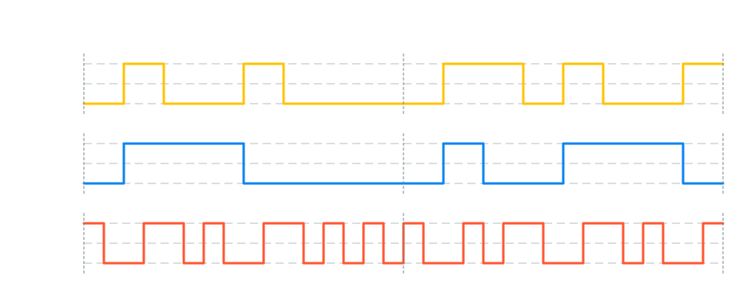

# siggi
Siggi creates beautiful timing diagram as svg image. 

It can be used as a library or a cli program to generate the signal from an json file. 

## Installation 

### Using cargo

At the moment the best way to test siggi is by cloning this repo and using cargo to run siggi. 

I have plans to publish this to crates.io some day.

## Usage
### CLI

```shell
USAGE:
    siggi [OPTIONS]

OPTIONS:
    -h, --help                       Print help information
    -i, --input-file <INPUT_FILE>
    -o, --output <OUTPUT>            [default: ./siggi.svg]
    -V, --version                    Print version information
```

#### Input File

```json
{
    "signals": [
        {
            "name" : "NRZ",
            "wave" : "lhllhllllhhlhllh",
            "color" : "Yellow",
            "tocks": ["0","1","0","0","1","0","0","0","0","1","1","0","1","0","0","1"],
            "markers" : [0,8,16]
        },
        {
            "name": "NRZ-I",
            "wave": "lhhhlllllhllhhhl",
            "color": "Blue",
            "tocks": ["0","1","0","0","1","0","0","0","0","1","1","0","1","0","0","1"],
            "markers" : [0,8,16]
        },
        { 
            "name": "Manchester",
            "wave": "duddudddduududdu",
            "color" : "Red",
            "tocks": ["0","1","0","0","1","0","0","0","0","1","1","0","1","0","0","1"],
            "markers" : [0,8,16]
        }
    ],
    "config" : {
        "title": "Leitungscodierungen"
    }
}
```
#### Output 



### Library

See the examples folder.

## About the project

The main purpose of this project is to get started with rust programming.
So i am thankfull for every advice and suggestion for improvement.

Another motivation was to generate nice timing diagrams for education and presentation purpose.
I took some inspiration from [wavedrom](https://wavedrom.com/).


